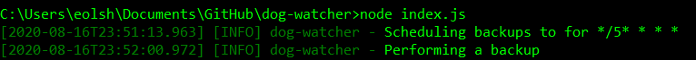
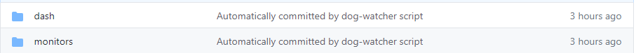

# Store dashboard and monitor configurations on GitHub with `dog-watcher`

Whether you have a few or a few hundred dashboards and monitors, `dog-watcher` simplifies the configuration storage. Using the `dog-watcher` library you can automatically store dashboard and monitor configurations from Datadog as JSON in a GitHub repository.

Dashboard and monitor configuration backup can run just once, or `dog-watcher` can be set to a specific time interval. If run regularly, `dog-watcher` can be used to create a change history (excluding authors) for Datadog objects.

This blog post will show you how to configure and run `dog-watcher`. You'll learn about:

- the prerequisites for running `dog-watcher`
- how to update your [configuration file](#update-conf.json.example)
- how to [start `dog-watcher`](#start-dog-watcher)
- which environment variables to set for [debugging](#debugging)

## Prerequisites
- Install [Node.js and npm](https://www.npmjs.com/get-npm). You can test if the packages are installed by running `node -v` and `npm -v` from a command line.
- A GitHub account and an [SSH key](https://docs.github.com/en/github/authenticating-to-github/connecting-to-github-with-ssh) configured to allow git write access.
- Clone the `dog-watcher` project.

## Update **conf.json.example**

The **conf.json.example** file needs to be updated to capture and store your dashboard and monitor configurations. If you want to use a different file read the [Start `dog-watcher`](#start-dog-watcher) section.

Take the following steps to update your **conf.json.example** file:
1. Rename **conf.json.example** to **conf.json**.
1. Fill in `yourApiKey` with your API key and `yourAppKey` with your app key. 
    ```json
    "dataDogApiKey": "yourApiKey",
    "dataDogAppKey": "yourAppKey"
    ```
    You can find your Datadog API and app keys in the [APIs](https://app.datadoghq.com/account/settings#api) tab under Integrations in the Datadog UI.
2. Fill in `your` in the URL with the name of the GitHub account and `backupRepo` with the name of the backup repository where the configurations will be stored: 

    ```json
    "gitRepoForBackups": "git@github.com:your/backupRepo.git"
    ```

At this point you're ready to run `dog-watcher`. However, you may want to set the following optional parameters:
- `sendEventOnNoop`: Determines whether a DataDog event is sent in the event that nothing has changed since the last git commit. Defaults to `False`.
    ```json
    "sendEventOnNoop": "False"
    ```
- `noopEventMessage`: Your own custom noop message. Defaults to `Nothing to see here`. 
    ```json
    "noopEventMessage": "Nothing to see here"
    ```
- `backupInterval`: See the [Scheduling](#scheduling) section below.

### Scheduling

The final optional paramater in **conf.json.example** is `backupInterval`. By default `dog-watcher` will only do a one time backup of your dashboard and monitor configurations. To set a backup interval, specify a valid cron interval value for `backupInterval` The example below shows a `backupInterval` set to run every **10 minutes**:

```json
"backupInterval": "*/10 * * * *"
```

## Start dog-watcher

Navigate to the folder containing **conf.json**. Run the following from the command line to start `dog-watcher`:

```cmd
npm install
node index.js
```
After running `node index.js` you'll see the following if you're using the default value for `backupInterval`:



You can specify an alternate configuration file using the syntax `--config <alternate-file>.json`.

>[! NOTE]
> When running `dog-watcher` with [PM2](https://github.com/Unitech/PM2/blob/master/README.md) use the command `npm start`. This ensures that `dog-watcher` stays running.

Once `dog-watcher` has collected and stored your configurations you will see the `dash` and `monitors` folders in your backup repository, seen below:



## Debugging
 
The following environment variables can be set for debugging `dog-watcher`:

- `DEBUG`: If true, leaves behind the temp work directory that is used for cloning and committing to the backup repository. The default behavior is to delete the directory on exit.
- `LOG_LEVEL`:  Log4js logging level. Options include: `ERROR`, `WARN`, `INFO` and `DEBUG`. The default is `INFO`.

## Acknowledgements 

A big thanks to [tomruggs](https://github.com/tomruggs) and [huydinhle](https://github.com/huydinhle) for contributing to `dog-watcher`. 