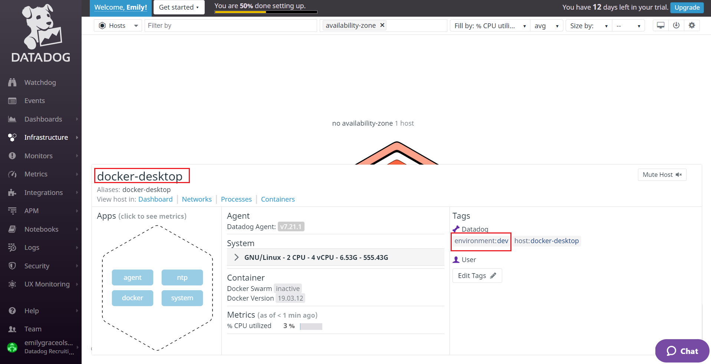
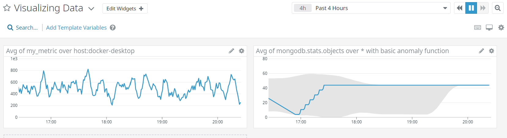
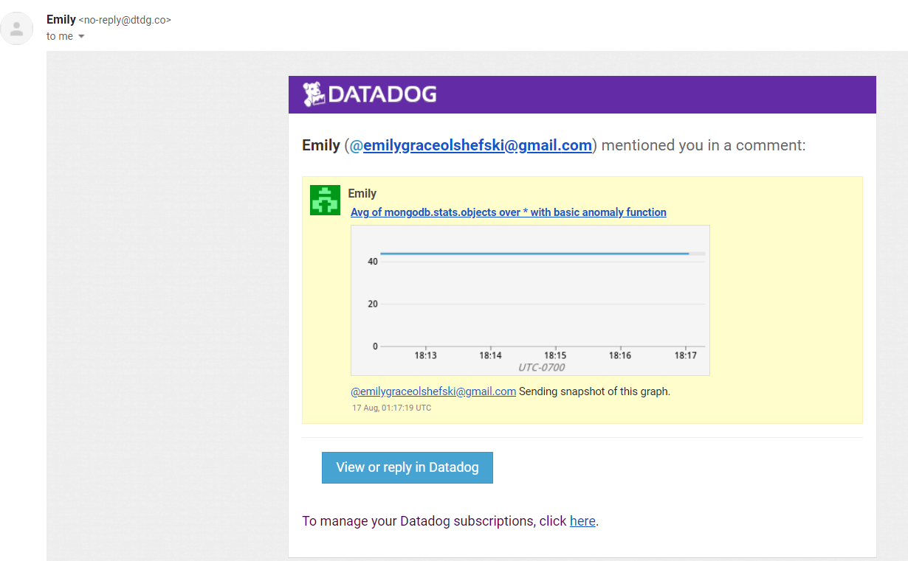

# Take Home Assignment Answers

## Collecting Metrics

Below is a screenshot of a hostmap of my host, **docker-desktop**, and the tag **environment:dev**:

See the following files for code I used in this section:

- [datadog.yaml](datadog.yaml): Added tag **environment:dev**
- [custom_mymetric.py](custom_mymetric.py): Code used to create **my_metric**

## Visualizing Data

## Visualize my_metric and MongoDB metric

Below is a screenshot of my dashboard:

See [**create_dashboard.py**](create_dashboard.py) for the code used to create this dashboard. 

**Bonus Questions**: What is the Anomaly graph displaying?

- The anomaly graph is diplaying a grey band overlay that shows the expected series of behavior based on the past. This particular algorithm is showing the number of expected objects in the MongoDB databse. Data within the gray bounds can be interepreted as standard deviations for the algorithm.

### Send a snapshot using @

Below is a screenshot confirming I sent a snapshot to myself using the @ notation:

## Final Questions

I chose the [`dog-watcher`]((https://github.com/brightcove/dog-watcher) community library.
Here's a link to my blog post: [Store dashboard and monitor configurations on GitHub with `dog-watcher`](dog-watcher-blog-post.md)